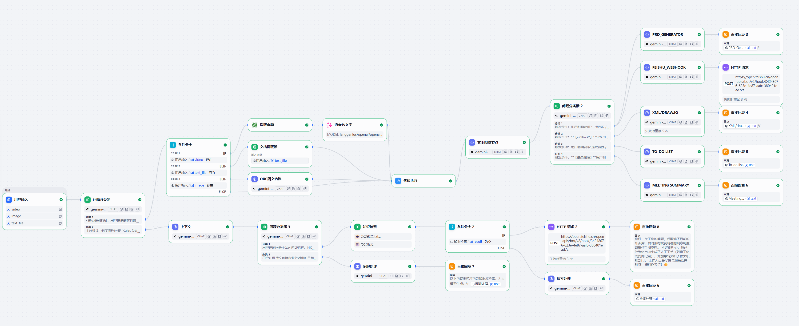

# Multimodal-AI-Work-Assistant (多模态 AI 工作助手)

> 基于 Dify 构建的企业级多模态 AI 助手。项目集成了**多模态会议纪要处理**与**高阶 RAG 企业知识库**两大核心业务引擎。通过 Agentic Workflow（智能体工作流）、进阶 RAG 策略与 Prompt 工程，破解通用大模型难以直击真实业务场景的难题，实现从复杂信息处理到冗余咨询拦截的分钟级降本增效。

---

## 🎯 项目概述

当前 AI 工具在企业落地时常面临输入数据碎片化、用户意图不清晰、输出结果无法直接使用、以及企业知识库检索存在“幻觉与孤岛”等痛点。

本项目搭建了一个中央调度工作流，实现了从多源数据（视频/语音/截图/文档）输入、文本降噪清洗、意图路由分发，到最终结果自动化推送与人工工单兜底的完整业务链路。开发者可通过本项目参考复杂大模型工作流（Agentic Workflow）在实际业务场景中的落地实践。

---

## ✨ 核心模块 

项目包含三个核心业务模块，深度应对典型的企业办公与后勤场景：

### 🎙️ 1. 多模态产研会议助手 
解析非结构化的会议记录，根据用户指令生成结构化摘要、PRD 文档、Draw.io 架构图或任务分配单。
* **多模态数据摄入**：结合 Python 脚本处理不同底层数据格式，对 PDF、音频转录文字 (ASR) 和图片识别文字 (OCR) 进行统一的数据清洗。
* **意图路由网关**：通过系统级 Prompt 缓解长文本带来的注意力偏移问题，确保系统优先执行用户的明确指令，而非被会议内容误导。
* **结构化流控制**：通过预设视觉组件字典，约束大模型直接生成包含拓扑关系的 draw.io `mxGraphModel` XML 代码。

### 🔍 2. 内部规 RAG 知识库
针对企业内部 HR/IT 冗余咨询过多、规章检索孤岛化等痛点，搭建具备“意图识别”与“人工兜底”的高阶 RAG Agent。
* **提问重写与意图路由**：首创 LLM 提问重写节点进行指代消解与上下文补全。部署意图分类网关，将“规章查询”与“日常闲聊”进行物理管线隔离，避免模型产生角色冲突。
* **结构化切分 (Markdown Chunking)**：针对复杂规章制度与表格，弃用传统的按字数粗暴切分。采用基于 Markdown 标题层级 (`#` / `##`) 的结构化提取与 CSV 行转列策略，保留严谨的逻辑上下文。
* **混合检索与重排 (Rerank)**：结合全文与向量检索，并引入 `bge-reranker` 交叉编码器进行深度语义打分。设定严格的 Score 阈值，精准过滤低质量召回。
* **零幻觉与人工工单兜底 (Fail-Fast)**：强约束模型基于 `{{context}}` 输出带有文件引用的解答。当检索未命中或低于阈值时，自动拦截大模型生成，通过 Webhook 静默拉起飞书/钉钉的人工工单系统，实现完美闭环。

---

## 🧠 Prompt Engineering 实践 

本项目参考了主流 Prompt 工程原则，重点优化了系统在复杂管线中的稳定性：

1. **指令与分隔符**：使用 `{{}}`、Markdown 标题及 XML 标签作为定界符，将角色定义、规则与用户输入文本隔离，防止提示词注入。
2. **结构化输出要求**：通过 Few-shot 示例，要求模型输出标准格式的 JSON Payload（用于 Webhook）和 Markdown 代码块，避免前端解析冲突。
3. **物理隔离与角色剥离**：在 RAG 知识库中，为“规章解答”与“日常闲聊”配置完全独立的 System Prompt。前者极度保守且强制溯源，后者高情商且具备业务边界护栏。
4. **步骤拆解**：将复杂任务分解为“提问重写 ➔ 意图判定 ➔ 混合检索 ➔ 阈值判断 ➔ 定向产出/拉取工单”的多个流转节点，将幻觉率降至最低。

---

## 🏗️ 系统架构与数据流

 

高阶 Agent 工作流主要包含以下环节：
1. **统一输入层**：接收图文、语音、文件类型等多模态数据。
2. **预处理与重写层**：Python 格式化脚本降噪 + LLM 多轮对话上下文补全。
3. **中央调度网关**：分析动作指令，执行精确的路由分发（多端分流）。
4. **生产线与引擎层**：PRD 生成 / 代码渲染 / 混合检索 + Rerank 重排打分。
5. **外部触达与兜底层**：生成带溯源引用的最终回答，或通过 HTTP 请求自动组装 JSON 推送至飞书。

---

## 🛠️ 技术栈与依赖

* **核心编排引擎**: Dify (Agentic Workflow)
* **大语言模型**: Gemini 3.1 Flash, GPT-5 mini, DeepSeek V3.2 等
* **检索与重排模型**: BCEmbedding, BGE-Reranker-v2
* **数据处理与清洗**: Python 3, Markdown Structural Chunking
* **API 集成**: OpenRouter, 飞书开放平台 Webhook
* **前端展现**: Markdown, Mermaid.js, draw.io XML

---

## 🚀 快速上手

### 环境要求
* 部署好的 Dify 平台账号（开源版或云端版）。
* 对应模型供应商的 API Key。
* （可选）用于接收消息/工单的飞书 Webhook 地址。

### 部署步骤
1. **克隆项目**: 将本项目下载到本地。
2. **导入工作流**: 登录 Dify，在工作室点击“导入 DSL 文件”，选择 `workflows/` 目录下的 `.yml` 文件（包含会议助手与高阶RAG知识库）。
3. **配置知识库**: 将 `test_cases/` 目录下的 Markdown 与 CSV 规章测试文件导入 Dify 知识库，并正确配置分段标识符（如 `\n# `）与自动表格处理。
4. **配置参数**: 在工作流画布中绑定知识库节点，确认 LLM 模型配置，并在【HTTP 请求】节点中填入实际的 Webhook 地址。
5. **运行测试**: 使用对话框进行边界测试（如输入“帮我写请假邮件”、“出差报销多少钱”、“忘带门禁卡怎么办”），观察系统的路由判定与工单兜底逻辑。

---

## 🔮 未来规划

- [ ] **多维表格接入**：通过 OAuth 鉴权，将提取到的任务清单自动写入飞书多维表格 (Bitable)。
- [ ] **多端渲染适配**：优化 XML 代码在不同界面的展示策略，增加 Mermaid 直出方案支持。
- [ ] **数据查询扩展**：增加支持 Text-to-SQL 的节点，实现数据库报表查询。

---

## 📚 相关目录索引

* [📂 核心工作流配置 (DSL)](workflows/README.md)
* [📂 核心提示词案例 (Prompts)](prompts_showcase/README.md)
* [📂 测试规章文件与测试语料包](test_cases/README.md)

---
*如果本项目对你有所帮助，欢迎点亮 Star ⭐️*
