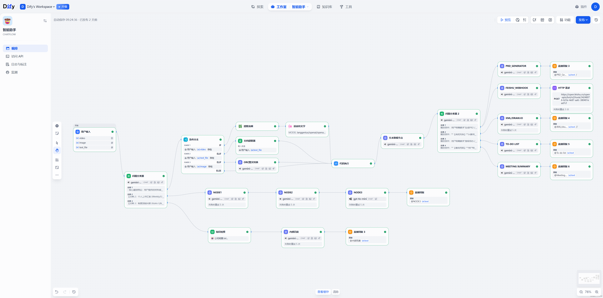

# Multimodal-AI-Work-Assistant (多模态 AI 工作助手)

> 基于 Dify 构建的企业级多模态 AI 助手。项目集成了**多模态会议纪要处理**、**智能周报生成**与**规章制度 RAG 检索**三大功能。通过 Agentic Workflow（智能体工作流）与 Prompt 工程，使大模型能够直接介入日常办公流程，提供具备工程实用价值的输出结果。

---

## 🎯 项目概述

当前 AI 工具在企业落地时常面临输入数据碎片化、用户意图不清晰、输出结果无法直接使用等问题。

本项目搭建了一个中央调度工作流，实现了从多源数据（语音/截图/文档）输入、文本降噪清洗、任务路由分发，到最终结果自动化推送（飞书/钉钉）的完整业务链路。开发者可通过本项目参考复杂大模型工作流在实际业务场景中的落地实践。

---

## ✨ 核心模块 

项目包含三个核心业务模块，应对典型的办公场景：

### 🎙️ 1. 多模态产研会议助手 
解析非结构化的会议记录，根据用户指令生成结构化摘要、PRD 文档、Draw.io 架构图或任务分配单。
* **多模态数据摄入**：结合 Python 脚本处理不同底层数据格式（List/String），对 PDF、音频转录文字 (ASR) 和图片识别文字 (OCR) 进行统一的数据清洗。
* **意图路由网关**：通过系统级 Prompt 缓解长文本带来的注意力偏移问题，确保系统优先执行用户的明确指令，而非被会议内容误导。
* **结构化流控制**：通过预设视觉组件字典，约束大模型直接生成包含拓扑关系 (Node & Edge) 的 draw.io `mxGraphModel` XML 代码。

### 📈 2. 智能工作汇报引擎 
将零散的日常工作记录提炼为符合标准规范（如 STAR 法则 / 目标-进度-风险模型）的正式汇报。
* **摘要提取**：过滤无关情绪表达与冗余信息，提高文本信噪比。
* **角色设定**：通过 Prompt 调整 AI 的输出风格，确保行文客观、专业。

### 🔍 3. 规章制度 RAG 检索库 
针对制度类问题提供带引用的准确解答，减少大模型的幻觉。
* **检索增强生成 (RAG)**：使用向量数据库实现文档分块 (Chunking) 与嵌入 (Embedding)。
* **事实约束**：限制模型仅基于检索到的文本片段生成答案，并设置了查无此内容的兜底逻辑。

---

## 🧠 Prompt Engineering 实践 

本项目参考了吴恩达 (Andrew Ng) 提出的 Prompt 工程原则，重点优化了系统的稳定性：

1. **指令与分隔符**：使用 `{{}}`、Markdown 标题及 XML 标签作为定界符，将角色定义、规则与用户输入文本隔离，防止提示词注入 (Prompt Injection)。
2. **结构化输出要求**：通过 Few-shot 示例，要求模型输出标准格式的 JSON Payload（用于飞书 Webhook）和 Markdown 代码块，避免前端解析冲突。
3. **条件检查与反幻觉机制**：在任务提取等场景中设定兜底逻辑。若上下文中未包含负责人或期限，要求模型必须输出 `[⚠️ 待认领]` 或 `[已延期]`，禁止自行推测缺失信息。
4. **步骤拆解**：将复杂任务分解为“文本降噪 ➔ 意图判定 ➔ 定向产出”的多个流转节点，降低单次逻辑推理的错误率。

---

## 🏗️ 系统架构与数据流

 
*(说明：请将 Dify 导出的架构流转截图替换此处的占位符图片)*

工作流主要包含以下环节：
1. **统一输入层**：接收图文、语音、文件类型数据。
2. **处理控制层**：文档提取器 + Python 格式化脚本 + 降噪 LLM。
3. **中央调度网关**：分析动作指令，执行路由分发。
4. **生产线与服务层**：PRD 生成 / Draw.io 代码生成 / 周报生成 / RAG 检索。
5. **外部触达层**：通过 HTTP 请求组装 API Payload，自动化推送到飞书/钉钉。

---

## 🛠️ 技术栈与依赖

* **核心编排引擎**: Dify (Agentic Workflow)
* **大语言模型**: Gemini 1.5 Pro / Flash, Claude 3.5 Sonnet 等
* **数据处理**: Python 3 
* **API 集成**: 飞书开放平台 Webhook
* **前端展现**: Markdown, Mermaid.js, draw.io XML

---

## 🚀 快速上手

### 环境要求
* 部署好的 Dify 平台账号（开源版或云端版）。
* 对应模型供应商的 API Key。
* （可选）用于接收消息的飞书/钉钉 Webhook 地址。

### 部署步骤
1. **克隆项目**: 将本项目下载到本地。
2. **导入工作流**: 登录 Dify，在工作室点击“导入 DSL 文件”，选择 `workflows/` 目录下的 `.yml` 文件。
3. **配置参数**: 在画布中确认 LLM 模型配置，并在【HTTP 请求】节点中填入实际的 Webhook 地址。
4. **运行测试**: 使用 `test_cases/` 文件夹中的会议记录作为输入，在对话框中追加具体指令（如：“请帮我生成画图代码”），查看输出结果。

---

## 🔮 未来规划

- [ ] **多维表格接入**：通过 OAuth 鉴权，将提取到的任务清单自动写入飞书多维表格 (Bitable)。
- [ ] **多端渲染适配**：优化 XML 代码在不同界面的展示策略，增加 Mermaid 直出方案支持。
- [ ] **数据查询扩展**：增加支持 Text-to-SQL 的节点，实现数据库报表查询。

---

## 📚 相关目录索引

* [📂 核心工作流配置 (DSL)](workflows/README.md)
* [📂 核心提示词案例](prompts_showcase/README.md)
* [📂 测试语料包](test_cases/README.md)

---
*如果本项目对你有所帮助，欢迎点亮 Star ⭐️*
